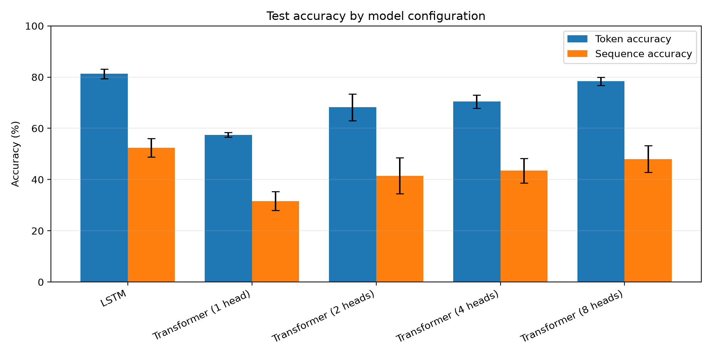
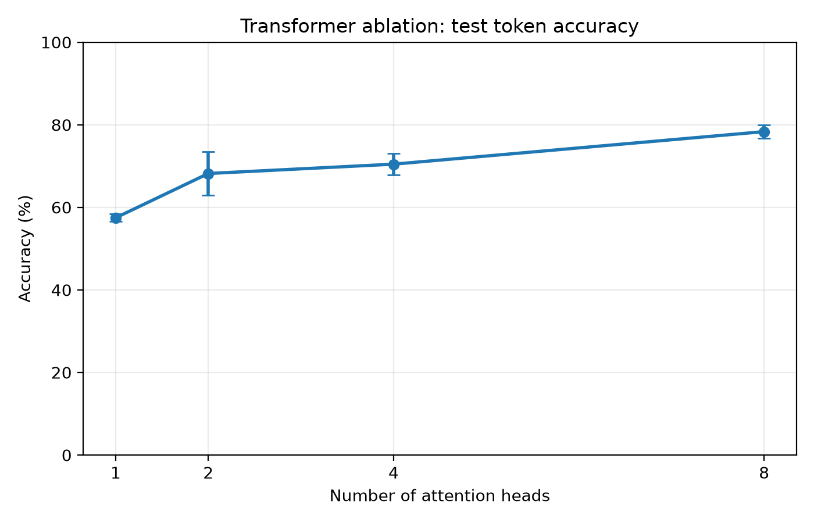
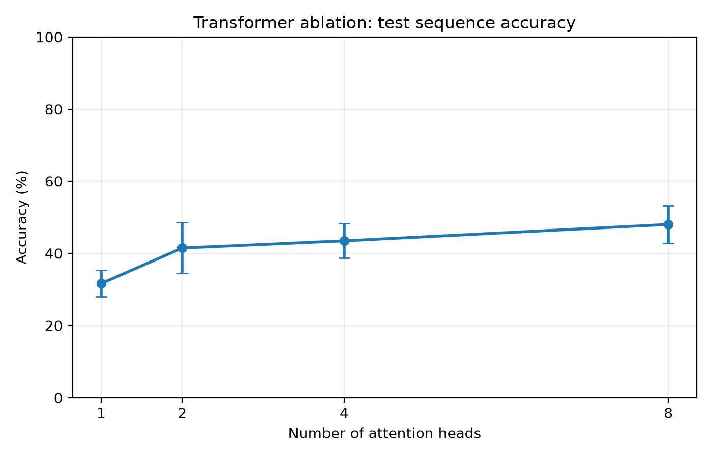
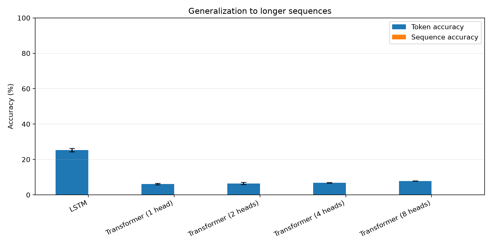

# Scientific report

## 1. Streszczenie artykułu

Vaswani et al. (2017) proponują Transformer, czyli model sekwencja-do-sekwencji oparty wyłącznie na mechanizmie uwagi, bez rekurencji ani splotów. Na tłumaczeniu maszynowym EN -> DE (zbiór WMT 2014) Transformer osiąga 27,3 punktu BLEU w wariancie bazowym i 28,4 w dużym, bijąc wszystkie wcześniejsze modele, w tym ensemble'e, o ponad 2 punkty BLEU. Co ważne, robi to przy niższym koszcie obliczeniowym: wariant duży kosztuje 2,3 × 10¹⁹ FLOP, podczas gdy najlepszy ensemble (GNMT+RL) potrzebował 1,8 * 10^20 FLOP, czyli niemal osiem razy więcej (Tabela 2). Autorzy formułują też drugie twierdzenie, weryfikowane w Tabeli 3: multi-head attention jest lepsze od single-head przy tym samym budżecie parametrów, choć zbyt wiele heads zaczyna pogarszać wyniki.

Artykuł wprowadza trzy kluczowe nowości. Po pierwsze, attention zamiast rekurencji: w LSTM informacja płynie przez ukryte stany krok po kroku, więc dwie odległe pozycje sekwencji komunikują się przez wiele pośrednich kroków. W self-attention każda pozycja może bezpośrednio spojrzeć na każdą inną już w jednym kroku, co umożliwia pełną równoległość obliczeń. Po drugie, multi-head attention: zamiast obliczać jedną funkcję uwagi, model oblicza ich h równocześnie, każda w mniejszej podprzestrzeni, co pozwala modelowi jednocześnie śledzić różne typy zależności w sekwencji. Po trzecie, sinusoidalne kodowanie pozycji: ponieważ self-attention nie rozróżnia kolejności tokenów, autorzy dodają do embeddingów stały wzorzec sinusoid niosący informację o pozycji, bez żadnych uczonych parametrów.

Transformer stał się fundamentem praktycznie każdego nowoczesnego dużego modelu językowego: BERT, GPT-2/3/4 i T5 to jego bezpośrednie pochodne.

Oryginalny eksperyment tłumaczeniowy jest nieosiągalny na laptopie: model bazowy ma 65M parametrów, był trenowany przez 12 godzin na 8 GPU P100, a zbiór danych to 4,5 miliona par zdań. Zamiast tego odtwarzamy ducha Tabeli 3 z artykułu: sprawdzamy, czy wielogłowicowa uwaga jest lepsza od jednogłowicowej przy tej samej liczbie parametrów. Robimy to na syntetycznym zadaniu odwracania sekwencji i porównujemy Transformery z h ∈ {1, 2, 4, 8} heads z modelem LSTM jako punktem odniesienia.

---

## 2. Metoda

Poniżej opisujemy kluczowe komponenty Transformera własnymi słowami, zgodnie z notacją z Vaswani et al. (2017). 

### 2.1 Skalowana uwaga iloczynowa

Podstawowy blok to *scaled dot-product attention*. Mamy trzy macierze: zapytania **Q**, klucze **K** i wartości **V**. Wyjście liczymy wzorem:

```
Attention(Q, K, V) = softmax( Q Kᵀ / √d_k ) V                   
```

Iloczyn QKᵀ mówi, jak bardzo każde zapytanie pasuje do każdego klucza. Softmax zamienia te wyniki w wagi, a następnie bierzemy ważoną sumę wartości V. Dzielenie przez √d_k zapobiega sytuacji, w której przy dużych wymiarach iloczyny skalarne stają się tak duże, że gradient softmaxa zanika. Autorzy uzasadniają to w przypisie 4: jeśli składowe q i k mają wariancję 1, to q·k ma wariancję d_k, więc skalowanie przywraca wariancję do 1.

W dekoderze dodajemy maskę przyczynową, żeby token na pozycji i nie widział tokenów z pozycji j > i:

```
score(i, j) = -∞   jeśli j > i
```

W implementacji jest to górnotrójkątna macierz logiczna z `torch.triu(..., diagonal=1)` przekazywana jako argument `tgt_mask`.

### 2.2 Multi-head attention 

Zamiast jednej funkcji uwagi model liczy ich h, każda na wektorach o wymiarze d_k = d_model/h:

```
head_i = Attention( Q W_i^Q,  K W_i^K,  V W_i^V )                 

MultiHead(Q, K, V) = Concat(head_1, ..., head_h) W^O              
```

Kluczowa właściwość: przy stałym d_model całkowita liczba parametrów w projekcjach nie zależy od h. Wynika to stąd, że h heads wymiaru d_model/h ma łącznie tyle samo parametrów co jeden head wymiaru d_model. Dzięki temu ablacja liczby heads jest uczciwa: modele różnią się podziałem przestrzeni reprezentacji, a nie pojemnością. Każdy head może wyspecjalizować się w innym typie zależności, a projekcja W^O scala wyniki z powrotem do wymiaru d_model.

### 2.3 Kodowanie pozycyjne 

Self-attention traktuje wejście jak nieuporządkowany zbiór: jeśli przestawimy tokeny, wyjście przestawi się tak samo. Żeby model wiedział o kolejności, autorzy dodają do embeddingów stały wektor pozycyjny przed pierwszą warstwą:

```
PE(pos, 2i)   = sin( pos / 10000^(2i / d_model) )                
PE(pos, 2i+1) = cos( pos / 10000^(2i / d_model) )                
```

Każda pozycja otrzymuje unikalny wzorzec sinusoid o geometrycznie rozłożonych częstotliwościach. Kodowanie jest deterministyczne, obliczone z góry i nie wymaga uczenia. W naszej implementacji embedding jest najpierw mnożony przez √d_model (zgodnie z zaleceniem autorów), a dopiero potem dodajemy kodowanie pozycyjne, żeby oba miały zbliżoną skalę.

### 2.4 Sieć feed-forward 

Po bloku uwagi każda warstwa zawiera prostą dwuwarstwową sieć w pełni połączoną, stosowaną niezależnie do każdej pozycji:

```
FFN(x) = max(0, x W₁ + b₁) W₂ + b₂                            
```

W oryginalnym artykule d_ff = 2048, czyli czterokrotność d_model = 512. U nas d_ff = 256, co daje podobną proporcję względem d_model = 128.

### 2.5 Połączenia rezydualne i normalizacja warstwy

Każdy podblok (uwaga lub FFN) jest opakowany w połączenie rezydualne z normalizacją warstwy:

```
Wyjście = LayerNorm( x + Podblok(x) )                            
```

Połączenie rezydualne ułatwia przepływ gradientów przez głęboką sieć. LayerNorm normalizuje aktywacje wzdłuż wymiaru cech niezależnie dla każdej pozycji, co stabilizuje trening bez uzależnienia od rozmiaru batcha. Używamy `norm_first=False`, czyli post-norm, zgodnie z wersją z artykułu.

### 2.6 Architektura enkoder–dekoder 

Model składa się z enkodera i dekodera, każdy z N warstw.

Enkoder przetwarza sekwencję źródłową: każda warstwa to self-attention z maską paddingu, po którym następuje FFN. Wyjście enkodera to ciąg wektorów nazywany w kodzie *memory*.

Dekoder generuje sekwencję docelową token po tokenie. Każda warstwa zawiera trzy podbloki: maskowaną self-attention (maska przyczynowa zapobiega podglądaniu przyszłości), cross-attention do pamięci enkodera, oraz FFN.

Podczas treningu stosujemy *teacher forcing*: dekoder otrzymuje na wejście prawdziwe tokeny docelowe. Podczas ewaluacji generujemy zachłannie, krok po kroku, podając własne poprzednie wyjście.

### 2.7 Baseline LSTM

Jako punkt porównawczy trenujemy enkoder–dekoder LSTM. Enkoder czyta całą sekwencję i produkuje końcowy stan ukryty, którym inicjalizujemy dekoder. Nie ma tu żadnego mechanizmu uwagi. Szerokość ukryta wynosi d_model = 128, przez co LSTM ma około 540K parametrów wobec 675K Transformera. Różnica wynika z oddzielnych tablic embeddingów dla źródła i celu w Transformerze.

### 2.8 Konfiguracje modeli dla ablacji

Wszystkie cztery warianty Transformera mają identyczne hiperparametry: d_model = 128, d_ff = 256, N = 2 warstwy, dropout = 0,1. Różni je wyłącznie liczba heads:

| h (heads) | d_k = d_model/h | Liczba parametrów |
|-------------|-----------------|-------------------|
| 1           | 128             | ≈ 675 K           |
| 2           | 64              | ≈ 675 K           |
| 4           | 32              | ≈ 675 K           |
| 8           | 16              | ≈ 675 K           |

Stałość liczby parametrów jest weryfikowana testem jednostkowym `test_parameter_counts_identical_across_head_configs` w `tests/test_architecture.py`.

---

## 3. Experimental setup

We use a deterministic synthetic sequence-reversal task. Input tokens are sampled
uniformly from a vocabulary of 29 data symbols; token 0 is reserved for padding,
token 1 begins decoder input (`BOS`), and token 2 is an explicit end-of-sequence
marker (`EOS`). The marker makes the
length observable when examples of different lengths share a padded batch. The
training set contains 10,000 sequences, while the validation and in-distribution
test sets contain 1,000 sequences each. Their lengths are sampled uniformly from
5 to 20 tokens. A separate 1,000-example test set contains lengths 21–40 and is
used only to measure out-of-distribution length generalization. The four splits
are generated from independent, recorded pseudorandom seeds.

The primary model is a two-layer encoder–decoder Transformer with sinusoidal
positional encoding, model width 128, feed-forward width 256, ReLU activation,
and dropout 0.1. A two-layer encoder–decoder LSTM with the same embedding and
hidden width is used as a baseline. Both models use teacher forcing during
training and greedy autoregressive decoding during evaluation. For the ablation,
the Transformer uses 1, 2, 4, or 8 heads
while keeping `d_model=128`; therefore the projection parameter count is fixed
and only the per-head width changes.

Models are trained with AdamW, learning rate 0.001, weight decay 0.0001, batch
size 64, cross-entropy loss ignoring padding, and gradient norm clipping at 1.0.
Training lasts at most 20 epochs and stops after five epochs without improvement
in teacher-forced validation loss. Autoregressive decoding is deliberately
reserved for the final validation and test passes to keep the sweep feasible.
Final configurations are run with seeds 13, 37, and 71. We report token accuracy, exact-sequence accuracy,
trainable parameter count, and wall-clock training time. Raw per-epoch histories,
checkpoints, configuration, software versions, and hardware metadata are saved
under `artifacts/`.

The final sweep was executed on Windows 11 using Python 3.12.13 and CPU-only
PyTorch 2.12.1 on 16 logical CPU threads. Individual LSTM runs took about
5.7 minutes on average, while Transformer runs took approximately 10.5–12.1
minutes on average depending on head count; the longest run remained well below
the four-hour hardware constraint.

These settings are a deliberate laptop-scale deviation from Vaswani et al.
(2017): the original WMT translation datasets and base/large models are replaced
by a controlled algorithmic task and a tiny model. The head-count ablation keeps
the central comparison of differently partitioned attention representations,
but its absolute results should not be interpreted as translation quality.

During protocol development we piloted a simpler encoder-only token classifier.
It plateaued at approximately 23% token accuracy and 0% exact-sequence accuracy,
even after adding an explicit `EOS` token. We rejected that simplification before
the multi-seed sweep and adopted the encoder–decoder protocol above.

## 4. Results

Wyniki końcowe zostały obliczone na podstawie trzech niezależnych seedów dla każdej konfiguracji modelu. W tabeli pokazano średnią oraz odchylenie standardowe. Porównanie obejmuje model bazowy LSTM oraz cztery warianty Transformera z 1, 2, 4 i 8 głowami uwagi.

| Konfiguracja | Seedy | Parametry | Dokładność tokenów test | Dokładność sekwencji test | Dokładność tokenów generalizacja | Dokładność sekwencji generalizacja |
| --- | --- | --- | --- | --- | --- | --- |
| LSTM | 3 | 540,704 | 81.3 +/- 1.9% | 52.4 +/- 3.6% | 25.3 +/- 1.0% | 0.0 +/- 0.0% |
| Transformer (1 head) | 3 | 675,360 | 57.5 +/- 0.9% | 31.6 +/- 3.6% | 6.1 +/- 0.4% | 0.0 +/- 0.0% |
| Transformer (2 heads) | 3 | 675,360 | 68.2 +/- 5.3% | 41.5 +/- 7.0% | 6.5 +/- 0.6% | 0.0 +/- 0.0% |
| Transformer (4 heads) | 3 | 675,360 | 70.5 +/- 2.6% | 43.5 +/- 4.8% | 6.8 +/- 0.1% | 0.0 +/- 0.0% |
| Transformer (8 heads) | 3 | 675,360 | 78.3 +/- 1.6% | 48.0 +/- 5.2% | 7.9 +/- 0.1% | 0.0 +/- 0.0% |



*Figure 1. Test token accuracy and exact-sequence accuracy for the LSTM baseline and Transformer variants.*

Najlepszym wariantem Transformera okazał się model z 8 głowami uwagi. Osiągnął on 78.3% dokładności tokenów oraz 48.0% dokładności całych sekwencji na zbiorze testowym. Mimo to najlepszy ogólny wynik uzyskał baseline LSTM, który osiągnął 81.3% dokładności tokenów oraz 52.4% dokładności całych sekwencji.

Wynik ten pokazuje, że Transformer wyraźnie korzystał ze zwiększenia liczby głów uwagi, ale w tym uproszczonym zadaniu odwracania sekwencji nie przebił modelu rekurencyjnego. Zbiór generalizacyjny z dłuższymi sekwencjami był trudny dla wszystkich modeli. Dokładność całych sekwencji wyniosła tam 0.0% dla każdej konfiguracji, co sugeruje, że modele nauczyły się głównie rozkładu długości z treningu, a nie w pełni ogólnego algorytmu odwracania sekwencji.

## 5. Ablation: number of attention heads

Ablacja liczby głów uwagi sprawdza, czy podział reprezentacji na więcej głów poprawia działanie Transformera przy tej samej liczbie parametrów. Wszystkie warianty Transformera miały tę samą szerokość modelu `d_model = 128`, tę samą liczbę warstw i tę samą liczbę parametrów równą 675,360. Różniły się wyłącznie liczbą głów uwagi.

| Liczba głów | Dokładność tokenów test | Dokładność sekwencji test | Dokładność tokenów generalizacja | Dokładność sekwencji generalizacja |
| --- | --- | --- | --- | --- |
| 1 | 57.5 +/- 0.9% | 31.6 +/- 3.6% | 6.1 +/- 0.4% | 0.0 +/- 0.0% |
| 2 | 68.2 +/- 5.3% | 41.5 +/- 7.0% | 6.5 +/- 0.6% | 0.0 +/- 0.0% |
| 4 | 70.5 +/- 2.6% | 43.5 +/- 4.8% | 6.8 +/- 0.1% | 0.0 +/- 0.0% |
| 8 | 78.3 +/- 1.6% | 48.0 +/- 5.2% | 7.9 +/- 0.1% | 0.0 +/- 0.0% |



*Figure 2. Effect of the number of attention heads on Transformer test token accuracy.*



*Figure 3. Effect of the number of attention heads on Transformer exact-sequence accuracy.*

Największa poprawa wystąpiła po przejściu z jednej głowy do dwóch głów uwagi. Dokładność tokenów wzrosła wtedy z 57.5% do 68.2%, a dokładność całych sekwencji z 31.6% do 41.5%. Kolejne zwiększanie liczby głów nadal poprawiało wynik, ale zmiana z 2 do 4 głów była już mniejsza niż zmiana z 1 do 2 głów.

Najlepszy wynik wśród Transformerów uzyskała konfiguracja z 8 głowami. W porównaniu z wariantem jednogłowicowym poprawiła dokładność tokenów na zbiorze testowym o 20.8 punktu procentowego oraz dokładność całych sekwencji o 16.4 punktu procentowego. Ponieważ liczba parametrów była taka sama we wszystkich wariantach, wynik ten wspiera hipotezę, że wiele głów uwagi może lepiej rozdzielać różne zależności w sekwencji niż pojedyncza głowa o większym wymiarze.

Jednocześnie ablacja nie pokazuje pełnej generalizacji algorytmicznej. Na dłuższych sekwencjach wszystkie warianty miały 0.0% dokładności całych sekwencji. Oznacza to, że większa liczba głów poprawiła jakość predykcji w rozkładzie testowym podobnym do treningowego, ale nie wystarczyła do nauczenia modelu niezależnego od długości algorytmu odwracania sekwencji.

## 6. Limitations and reproducibility notes

Najważniejszym ograniczeniem eksperymentu jest skala reprodukcji. Oryginalny artykuł Vaswani et al. (2017) dotyczył tłumaczenia maszynowego na dużych zbiorach danych i raportował wynik BLEU. W naszym projekcie nie odtwarzamy pełnego eksperymentu WMT, tylko jego uproszczony odpowiednik: syntetyczne zadanie odwracania sekwencji. Dzięki temu eksperyment da się uruchomić lokalnie na laptopie, ale wyniki nie powinny być interpretowane jako bezpośrednie porównanie jakości tłumaczenia.

Drugim ograniczeniem jest rozmiar modeli. Używany Transformer jest znacznie mniejszy od modelu z oryginalnego artykułu: ma 2 warstwy, `d_model = 128` i około 675 tysięcy parametrów. Ograniczony budżet obliczeniowy wpływa również na liczbę epok, liczbę seedów i zakres przeszukiwanych hiperparametrów. Z tego powodu wyniki pokazują raczej trend w małej kontrolowanej konfiguracji, a nie pełną przewagę jednej architektury nad drugą.

Ważnym wynikiem negatywnym jest słaba generalizacja na dłuższe sekwencje. Wszystkie modele uzyskały 0.0% dokładności całych sekwencji na zbiorze z długościami 21-40, mimo że na zbiorze testowym o długościach znanych z treningu osiągały znacznie lepsze wyniki. Oznacza to, że modele nauczyły się zachowania przy długościach treningowych, ale nie w pełni ogólnego algorytmu odwracania sekwencji.



*Figure 4. Generalization performance on longer sequences outside the training length range.*

Reprodukowalność projektu opiera się na zapisanych seedach, konfiguracji eksperymentu i surowych wynikach w `results/raw_runs.csv`. Skrypt `src/tiny_transformer/analysis.py` generuje końcowe tabele i wykresy do folderu `results/analysis/`. Dzięki temu część analityczna nie wymaga ponownego trenowania modeli: można odtworzyć średnie, odchylenia standardowe i wykresy bez uruchamiania kosztownego sweepu treningowego.

Do pełnego odtworzenia wyników treningowych potrzebne jest uruchomienie eksperymentów dla trzech seedów oraz wszystkich konfiguracji modeli. Jest to możliwe z użyciem konfiguracji projektu, ale czasochłonne na CPU. Dlatego w repozytorium przechowywane są surowe wyniki końcowe, a analiza końcowa została oddzielona od samego treningu.

## 7. Conclusions

Projekt pozwolił odtworzyć w małej skali jedną z głównych obserwacji z pracy Vaswani et al. (2017): multi-head attention może być skuteczniejszy niż single-head attention przy tej samej liczbie parametrów. W naszych eksperymentach Transformer z 8 głowami osiągnął najlepszy wynik spośród wariantów Transformera, a model z jedną głową był wyraźnie najsłabszy.

Jednocześnie eksperyment nie potwierdził przewagi Transformera nad baseline'em LSTM w tej konkretnej konfiguracji. LSTM uzyskał najlepszy wynik testowy zarówno dla dokładności tokenów, jak i dla dokładności całych sekwencji. Najbardziej prawdopodobnym wyjaśnieniem jest to, że zadanie odwracania krótkich sekwencji jest dobrze dopasowane do modelu rekurencyjnego, a użyty Transformer był bardzo mały względem oryginalnej architektury.

Największym ograniczeniem pozostała generalizacja na dłuższe sekwencje. Żaden model nie osiągnął niezerowej dokładności całych sekwencji na przykładach dłuższych niż te widziane podczas treningu. Pokazuje to, że dobre wyniki w rozkładzie testowym nie muszą oznaczać nauczenia ogólnego algorytmu.

Podsumowując, projekt skutecznie pokazuje mechanikę i sens ablacji liczby głów uwagi, ale nie jest pełną reprodukcją wyników tłumaczeniowych z oryginalnego artykułu. Najważniejszy wniosek praktyczny jest taki, że zwiększenie liczby głów poprawiło działanie Transformera w tym eksperymencie, jednak architektura LSTM pozostała mocnym baseline'em dla prostego zadania sekwencyjnego.

## References

Vaswani, A., Shazeer, N., Parmar, N., Uszkoreit, J., Jones, L., Gomez, A. N., Kaiser, Ł., & Polosukhin, I. (2017). Attention is all you need. Advances in Neural Information Processing Systems, 30.